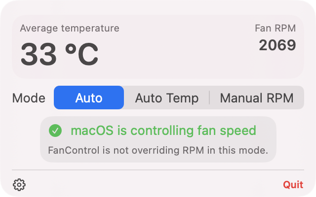
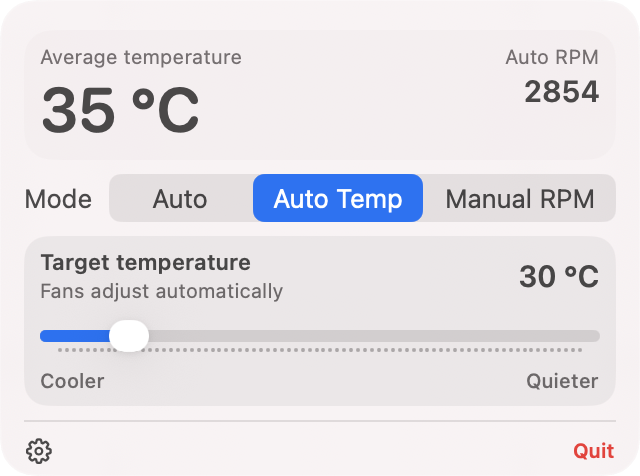
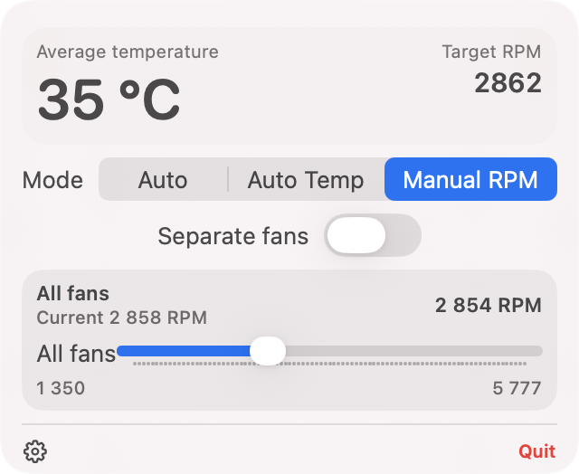
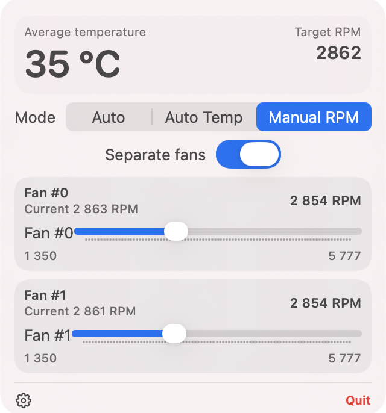

<h1 align="center">Vent for macOS</h1>

<p align="center">
  <a href="https://github.com/Fallet666/vent/releases/latest">
    
  </a>
  <a href="https://github.com/Fallet666/vent/releases">
    
  </a>
  <a href="https://github.com/Fallet666/vent/actions/workflows/ci.yml">
    
  </a>
  <a href="LICENSE">
    
  </a>
  <br>
  
  <a href="https://github.com/Fallet666/homebrew-tap">
    
  </a>
  
  
  
  
</p>

<p align="center">
  <b>Free · Open Source · No Telemetry · No Accounts</b>
</p>

<p align="center">
  <a href="https://github.com/Fallet666/vent/releases/latest">
    
  </a>
</p>

A clean, menu-bar fan control app for MacBooks. Set manual RPM, target a temperature, or instantly return to macOS automatic control — all from a simple popover.

Built for modern macOS (Apple Silicon and Intel). Uses a privileged launchd helper daemon for reliable SMC writes that stay active even when the menu bar app is closed.

---

## Features ✨

<table>
<tr>
<td width="50%">

**Three modes** — Auto, Manual RPM, Auto Temp — switch freely from the menu bar.

</td>
<td width="50%">

**Per-fan or unison** — control all fans together or tune each independently.

</td>
</tr>
<tr>
<td width="50%">

**Real SMC limits** — sliders use your Mac's actual min/max RPM ranges.

</td>
<td width="50%">

**Always-on daemon** — fan settings survive app quit via a launchd helper.

</td>
</tr>
<tr>
<td width="50%">

**Temperature display** — average sensor temperature shown in the popover.

</td>
<td width="50%">

**One-click install** — built-in helper installation and uninstall.

</td>
</tr>
</table>

---

## Screenshots 📸

<p align="center">
  
  
  
  
</p>

---

## Install 🚀

### Homebrew (recommended)

```bash
brew tap Fallet666/homebrew-tap
brew install --cask vent
```

Then launch Vent and follow the app's on-screen instructions to install the privileged helper.

### Manual (DMG)

1. Download the latest `.dmg` from [GitHub Releases](https://github.com/Fallet666/vent/releases/latest).
2. Open the DMG and drag `Vent.app` to `Applications`.
3. Launch Vent and click **Install / Update** in the menu-bar popover.

macOS will ask for an administrator password — this installs a privileged helper daemon into `/Library/LaunchDaemons` and CLI tools into `/usr/local/bin`.

To remove everything later, click **Uninstall** in the Settings panel.

> The app is ad-hoc signed. If macOS blocks it, right-click `Vent.app` and choose **Open**, or run:
> ```bash
> xattr -dr com.apple.quarantine /Applications/Vent.app
> ```

---

## How To Use 🎮

After launching, click the fan icon in the macOS menu bar.

### Auto
macOS and SMC control the fans normally. The safest fallback — recommended when you don't need manual cooling.

### Manual RPM
Set a fixed fan speed. Toggle **Separate fans** to adjust each fan independently. Sliders reflect your Mac's real RPM range.

### Auto Temp
Pick a target temperature instead of a raw RPM. The daemon watches sensors and adjusts fan speed automatically.

---

## Safety 🛡️

- Vent does **not** disable macOS thermal protection.
- **Auto** mode is always one click away.
- The daemon has a watchdog for manual RPM control.
- If anything looks wrong, switch to **Auto** or quit the app.

---

## CLI 🧑‍💻

Advanced users can use `ventctl` after installing the helper:

```bash
ventctl list          # list fans
ventctl temps         # show temperatures
ventctl daemon status # check daemon state
ventctl persist-all 2500  # set and persist RPM
ventctl unpersist-all     # return to macOS control
ventctl read F0Ac    # read raw SMC key
```

---

## Build From Source 🔨

Requirements: macOS, Xcode CLI Tools, CMake, SwiftPM.

```bash
cmake -S . -B build -DBUILD_TESTING=ON
cmake --build build
ctest --test-dir build --output-on-failure

cd gui/VentGUI
swift build -c release

# Package DMG
./package_dmg.sh
open dist/Vent-*.dmg
```

---

## Privacy 🔒

No analytics, no telemetry, no accounts, no external servers. The app only talks to its local helper daemon over a Unix socket at `/tmp/ventd.sock`.

---

## Contributing 🤝

Issues, compatibility reports, UI feedback, and PRs are welcome.

When testing a new Mac model, please use the [compatibility report template](.github/ISSUE_TEMPLATE/compatibility_report.yml) and include `ventctl list`, `ventctl temps`, and `ventctl daemon status`.

---

## License 📄

MIT. See [`LICENSE`](LICENSE).
